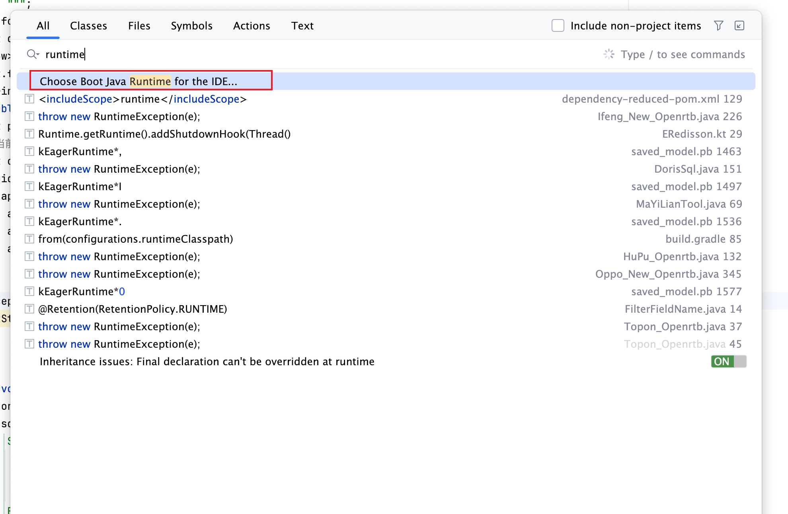
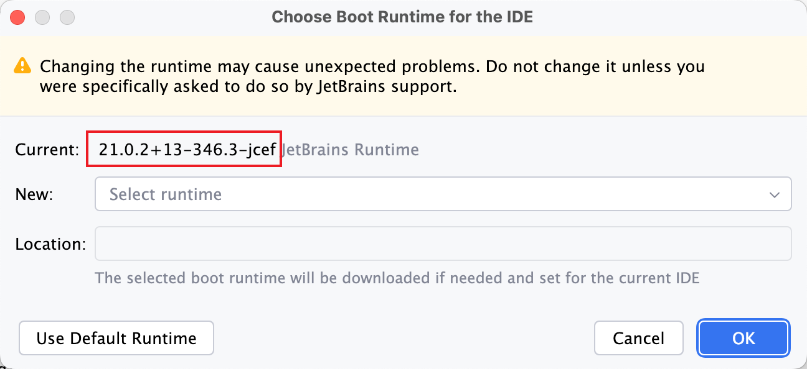
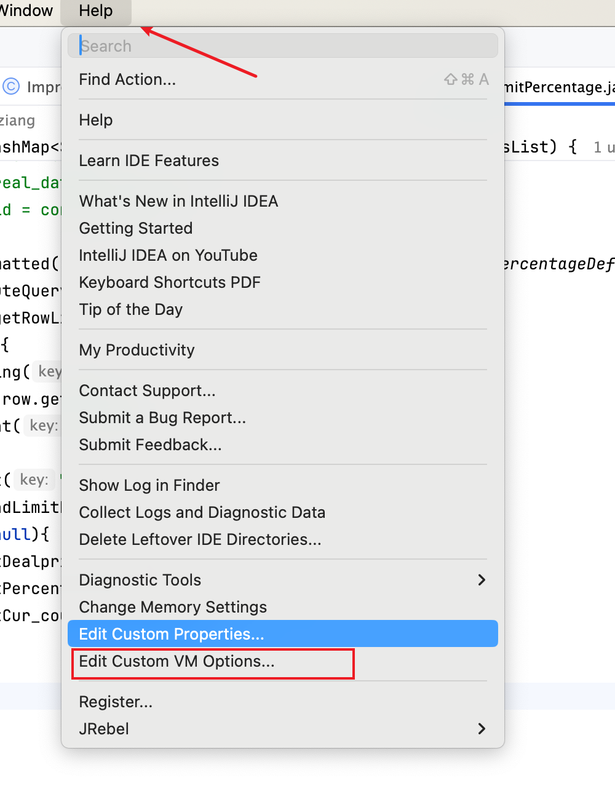
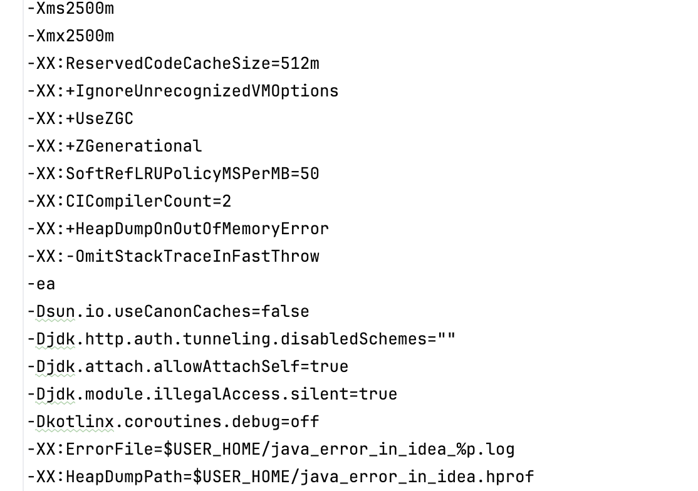

+++
title = 'IDEA 2024.1 版本提高流畅度方法'
date = 2024-03-21T20:25:00+08:00
draft = false
+++
# IDEA 2024.1 版本提高流畅度方法 {#idea-2024.1-%E7%89%88%E6%9C%AC%E6%8F%90%E9%AB%98%E6%B5%81%E7%95%85%E5%BA%A6%E6%96%B9%E6%B3%95 style=""}

今天看IDEA出了2024.1 ,本着尝鲜的想法安装了

正好前段时间测试了JDK21的分代ZGC,可以说基本就没有stop the
world,这不都安装了新版本了,顺便修改一下运行的JDK版本和垃圾回收机制

按两下`shift`
,然后输入runtime,选择红框这个

然后会提示重启IDEA,重启完成后,开始修改垃圾回收为分代ZGC,打开修改框之后删除G1的开关,增加`-XX:+UseZGC -XX:+ZGenerational`
这两个参数,我顺便修改了`-Xms2500m -Xmx2500m` 最大最小堆内存,就不需要扩容了,也可以降低卡顿

关于ZGC调优,经过我之前的测试,ZGC基本是不需要刻意调整的,如果非要调整加大堆内存量,就可以了.

