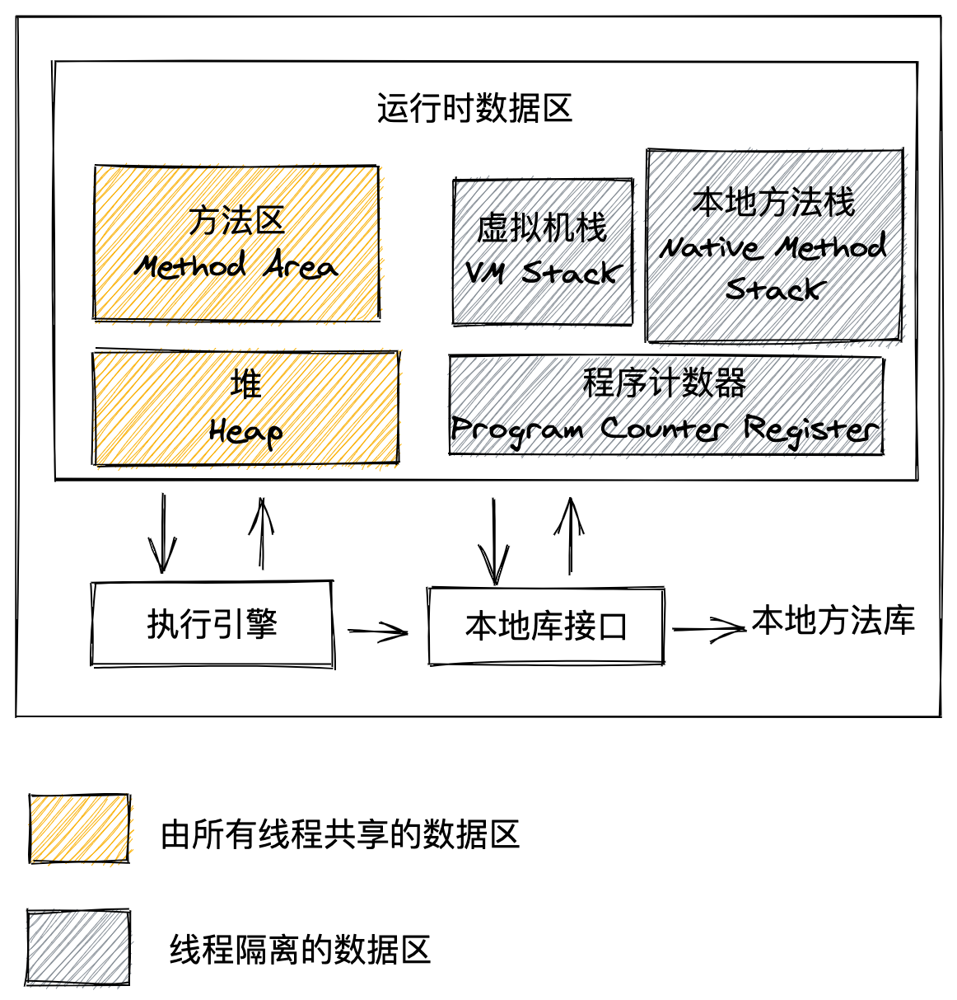

+++
title = 'Java内存区域'
date = 2021-03-22T08:02:07+08:00
draft = false
+++
# Java内存区域

首先看一下 Java 内存区域图:

## 程序计数器

程序计数器是一块较小的内存空间,它可以看做是当前线程所执行的字节码的行号指示器.

Java虚拟机的概念模型里,字节码解释器工作时就是通过改变这个计数器的值来选取下一条需要执行的字节码执行.

在多线程中,为了线程切换后能恢复到正确的执行位置,每条线程都需要有一个独立的程序计数器,各个线程之间计数器互不影响,独立存储,所以为\"线程私有\"的内存.

## Java虚拟机栈

Java虚拟机栈也是\"线程私有\",声明周期与线程相同.

Java虚拟机栈描述的是`Java方法执行的内存模型`

每个方法被执行的时候,Java虚拟机都会创建一个栈帧用于存储`局部变量表`操作数栈 动态连接 方法出口等信息.

每一个方法被调用直至执行完毕的过程,就对应着一个栈帧在虚拟机栈中从入栈到出栈的过程.

一般会把内存分为 堆内存和栈内存, 这里说的栈内存就是指
Java虚拟机栈中的局部变量表

局部变量表中 存放了这个方法运行时各种Java虚拟机基本数据类型(boolean byte
char short int float long double),对象引用和returnAddress类型.

这些数据类型的存储空间以局部变量槽(Slot)表示,其中long和double占用2个槽,其他占用1个槽,局部变量表所需的局部变量槽的数量在编译期间确定下来,一个槽的真正使用内存空间的多少,取决于具体虚拟机如何实现,可能是
32位也可能是64位
