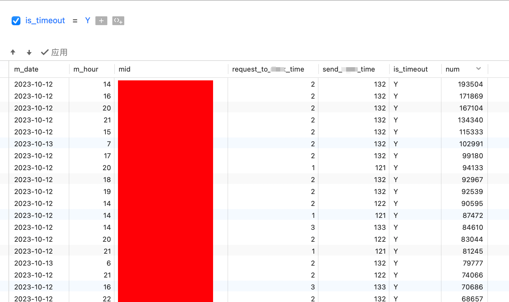
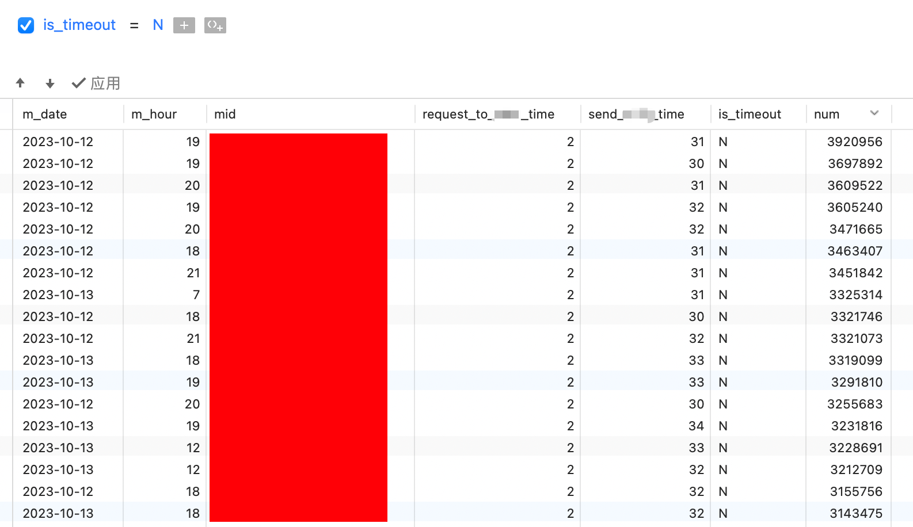
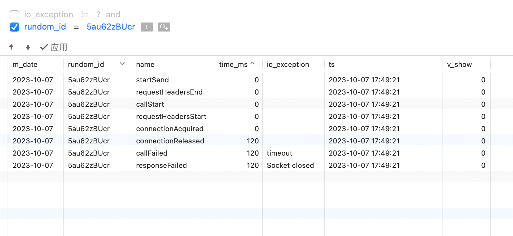

+++
title = 'OkHttp优化过程记录'
date = 2023-10-14T10:06:00+08:00
draft = false
+++
> 近期查看有请求下游系统超时,按百分比的话是0.8%的样子,但是每天量很大,超时总数不到1亿次,如果这个可以优化一点,提升巨大的

# 1.整体的探索过程 

> 目前只知道最终结果是超时,但是是不是哪里代码写的有问题从而导致的超时,还需要去定位

## 1.1初步定为问题 

首先记录两个时间,第一个是请求一进来一直到拼接发送请求的位置这段代码的,第二个是拼接请求一直到Response(或者超时了)这段代码的时间\
超时情况:\

不超时情况:\

从图上来看,不管是超时和不超时都第一个时间都不长,所以是拼接请求到接受Response的时候引起的超时

## 1.2更细化的定位问题 

> 现在知道是和发送请求有关系了,那么应该对于这部分代码增加详细的记录,来分析问题

[OkHttp监控与调优](https://zhaoxiaofa.com/2021/09/03/OkHttp%E7%9B%91%E6%8E%A7%E4%B8%8E%E8%B0%83%E4%BC%98/)查资料的时候看到这个文章写的不错\
经过一番查找资料,okhttp有一个EventListener,可以记录发送请求的各个步骤的时间\
于是就有了下边的代码

``` {.java .hljs}
public class PrintingEventListener extends EventListener {
    @Override
    public void requestBodyEnd(@NotNull Call call, long byteCount) {
        printEvent("requestBodyEnd");
    }

    @Override
    public void requestBodyStart(@NotNull Call call) {
        printEvent("requestBodyStart");
    }

    @Override
    public void responseBodyEnd(@NotNull Call call, long byteCount) {
        printEvent("responseBodyEnd");
    }

    @Override
    public void responseBodyStart(@NotNull Call call) {
        printEvent("responseBodyStart");
    }

    @Override
    public void responseHeadersEnd(@NotNull Call call, @NotNull Response response) {
        printEvent("responseHeadersEnd");
    }

    @Override
    public void responseHeadersStart(@NotNull Call call) {
        printEvent("responseHeadersStart");
    }

    public static final Factory FACTORY = new Factory() {

        @Override public EventListener create(Call call) {
            //唯一标识
            String randAllString = Format.getRandAllString(10);
            Random random = new Random(randAllString.hashCode());
            double nextDouble = random.nextDouble();
            //是tanx 与 10%的概率
            if(call.request().url().toString().equals("xxx")
                    && nextDouble * 100 <= 10){
                InitServlet.okhttpTimeLog.plus(randAllString,"startSend",0L,"");
                //System.out.printf("%s %s%n", randAllString, call.request().url());
                return new PrintingEventListener(randAllString, System.nanoTime());
            }else{
                return EventListener.NONE;
            }
        }
    };

    final String callId;
    final long callStartNanos;

    public PrintingEventListener(String callId, long callStartNanos) {
        this.callId = callId;
        this.callStartNanos = callStartNanos;
    }

    private void printEvent(String name) {
        long elapsedNanos = System.nanoTime() - callStartNanos;
        InitServlet.okhttpTimeLog.plus(callId,name,elapsedNanos / 1000000L,"");
        //System.out.printf("%s %.0fms %s%n", callId, elapsedNanos / 1000000d, name);
    }

    private void printEvent(String name,IOException ioe){
        long elapsedNanos = System.nanoTime() - callStartNanos;
        InitServlet.okhttpTimeLog.plus(callId,name,elapsedNanos / 1000000L,ioe.getMessage());
        //System.out.printf("%s %.0fms %s %s%n", callId, elapsedNanos / 1000000d, name,ioe.getMessage());
    }

    @Override
    public void callStart(Call call) {
        printEvent("callStart");
    }

    @Override
    public void dnsStart(Call call, String domainName) {
        printEvent("dnsStart");
    }

    @Override
    public void dnsEnd(Call call, String domainName, List<InetAddress> inetAddressList) {
        printEvent("dnsEnd");
    }

    @Override
    public void connectStart(Call call, InetSocketAddress inetSocketAddress, Proxy proxy) {
        printEvent("connectStart");
    }

    @Override
    public void secureConnectStart(Call call) {
        printEvent("secureConnectStart");
    }

    @Override
    public void secureConnectEnd(Call call, @Nullable Handshake handshake) {
        printEvent("secureConnectEnd");
    }

    @Override
    public void connectEnd(Call call, InetSocketAddress inetSocketAddress, Proxy proxy, @Nullable Protocol protocol) {
        printEvent("connectEnd");
    }

    @Override
    public void connectFailed(Call call, InetSocketAddress inetSocketAddress, Proxy proxy, @Nullable Protocol protocol, IOException ioe) {
        printEvent("connectFailed");
    }

    @Override
    public void connectionAcquired(Call call, Connection connection) {
        printEvent("connectionAcquired");
    }

    @Override
    public void requestHeadersStart(Call call) {
        printEvent("requestHeadersStart");
    }

    @Override
    public void requestHeadersEnd(Call call, Request request) {
        printEvent("requestHeadersEnd");
    }

    @Override
    public void connectionReleased(Call call, Connection connection) {
        printEvent("connectionReleased");
    }

    @Override
    public void requestFailed(Call call, IOException ioe) {
        printEvent("requestFailed",ioe);
    }

    @Override
    public void responseFailed(Call call, IOException ioe) {
        printEvent("responseFailed",ioe);
    }

    @Override
    public void callFailed(Call call, IOException ioe) {
        printEvent("callFailed",ioe);
    }

    @Override public void callEnd(Call call) {
        printEvent("callEnd");
    }

}
```

这个是记录的结果,这里只放一条数据了,可以明显看出来仅仅是等待Response的时候超时\


# 2.寻求优化问题的方法 

> 这个问题的根本原因是下游响应时间长导致的,首先我们是不可能去干预下游系统的,那从我们自身来看,有哪些可以优化的地方呢?

## 2.1okhttp各种参数的检查 

> 最常见的就是参数优化,调整参数之前需要有相应的日志或者当前数据来支持,没有数据的调参都是瞎搞

经过一番查找资料,收集了几个okhttp的参数,开始做监控

``` {.java .hljs}
//新增监控发送给dsp的线程池
            val queuedCallsCount = Java_To_Dsp_Handle.OkHttpClientTool.dispatcher.queuedCallsCount()
            val runningCallsCount = Java_To_Dsp_Handle.OkHttpClientTool.dispatcher.runningCallsCount()
            val connectionCount = Java_To_Dsp_Handle.OkHttpClientTool.connectionPool.connectionCount()
            val idleConnectionCount = Java_To_Dsp_Handle.OkHttpClientTool.connectionPool.idleConnectionCount()
            out.println("准备好发送的请求:${queuedCallsCount},正在发送的请求:${runningCallsCount}\n")
            out.println("发送请求的线程池情况:${Java_To_Dsp_Handle.OkHttpClientTool.threadPool}\n")
            out.println("目前建立的连接数量:${connectionCount},空闲的连接数量:${idleConnectionCount}\n")
            //每个host的请求数
            out.println(Java_To_Dsp_Handle.OkHttpClientTool.hostRequestCounterInterceptor.printRequestCountForHost())
```

以下是执行完之后的打印

``` {.hljs .language-java}
准备好发送的请求:0,正在发送的请求:65

发送请求的线程池情况:java.util.concurrent.ThreadPoolExecutor@3dceaaa5[Running, pool size = 600, active threads = 66, queued tasks = 0, completed tasks = 44826120]

目前建立的连接数量:316,空闲的连接数量:260

host:xxx  count:25
```

分析打印的结果:

1.  准备好发送的请求如果有值的话,那么就可能发生等待,这里并没有
2.  发送请求的线程池也没有满,也没有等待的任务,所以这个也没问题
3.  再有就是空闲连接也没有达到设置的值,也没问题
4.  最后一个是每个host最大并发数,也远低于设置的值

这一顿操作下来,发现参数并没有问题

## 2.2回归代码 

> 一般来说,陈年旧代码有优化空间的概率是比较大的,于是抱着试一试的心态,通读了okhttp发送的相关代码,发现确实有提升空间

OkHttpClient对象一般是不会创建很多个,所以之前老代码的逻辑是分成5个OkHttpClient对象,也就是5个梯度的等待时间\
比如当前需要等待67毫秒,那么按照梯度会选择超时时间设置为50的OkHttpClient对象,那么这个期间会有17ms的时间损失\
一顿查资料以及测试之后发现,OkHttpClient对象每个请求new一个是不合适的,new这个对象时间比较长,但是可以调用OkHttpClient对象的`okclient.newBuilder()`{.language-plaintext
.highlighter-rouge}方法重新设置超时时间,这种方式基本没有耗时

升级完成之后,Response的数量有所上涨,超时率数据目前还没出来,等出来了会补上,至此整个分析以及优化过程告一段落
