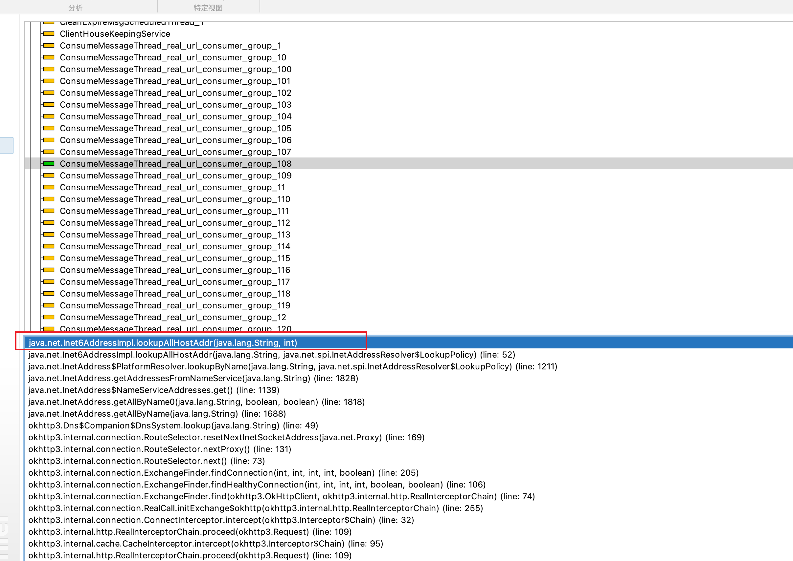
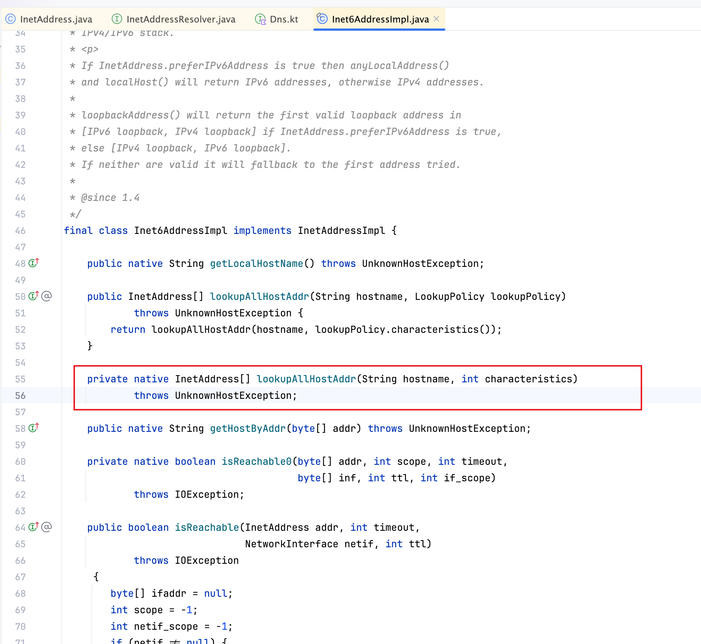

+++
title = 'Okhttp发送请求卡住问题解决'
date = 2024-04-18T20:16:00+08:00
draft = false
+++
# Okhttp发送请求卡住问题解决 

我们有一个消费者组是发送请求用的,一直有一个问题是有时候会堆积,然后就不消费了,重启后就恢复了\....

于是我让运维加了一个脚本,在堆积的时候触发这个脚本(dump出来文件),然后重启消费者组,先这样解决,等上班了再检查dump的文件

于是乎就有了下边这个图里的内容,发现其他线程都在wait,只有一个在runing,然后看到堆栈信息卡在了这个方法,点进去查看这个是一个native方法,这个目前看是做不了什么了

突然想到我们都是ipv4,这个是调用的ipv6的类,于是去查了资料发现可以在启动项上加`-Djava.net.preferIPv4Stack=true`{.language-plaintext
.highlighter-rouge}来使用ipv4类,加上之后跑了一星期没有再出现之前的问题,问题解决

