+++
title = 'RocketMQ消息过大导致消费者消费不了,导致消息堆积'
date = 2023-01-09T22:49:00+08:00
draft = false
+++
> 周日的时候,突然消费者组就开始堆积了,然后临时解决方案想着重新起一个消费者组看看能不能恢复,然而并不能,无奈之下只能迁回使用redis作为消息中间件的方式,周一再细查一下

## 1 遇到的报错以及现象 

首先是看的是Dashboard,发现一会消费者组里边有一个消费者,一会没有\
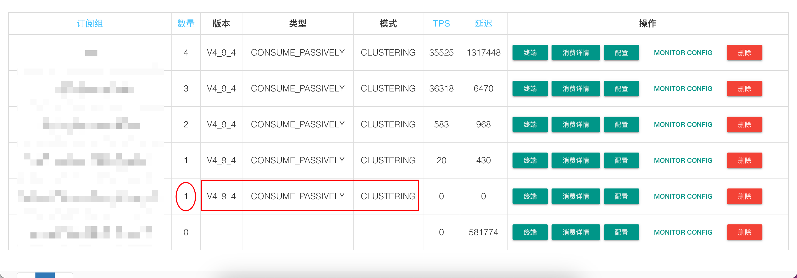
其次就该去看消费者组的业务日志打印了,虽然在消费,但是很慢\
接下来就是看了消费组的RocketMQ日志打印,发现开始报错刷屏

``` {.hljs .language-php}
2023-01-08 12:26:45,649 WARN RocketmqClient - execute the pull request exception
org.apache.rocketmq.client.exception.MQBrokerException: CODE: 24  DESC: the consumer's group info not exist
See http://rocketmq.apache.org/docs/faq/ for further details. BROKER: 192.168.1.58:10911
        at org.apache.rocketmq.client.impl.MQClientAPIImpl.processPullResponse(MQClientAPIImpl.java:803)
        at org.apache.rocketmq.client.impl.MQClientAPIImpl.access$200(MQClientAPIImpl.java:175)
        at org.apache.rocketmq.client.impl.MQClientAPIImpl$2.operationComplete(MQClientAPIImpl.java:754)
        at org.apache.rocketmq.remoting.netty.ResponseFuture.executeInvokeCallback(ResponseFuture.java:54)
        at org.apache.rocketmq.remoting.netty.NettyRemotingAbstract$2.run(NettyRemotingAbstract.java:321)
        at java.base/java.util.concurrent.Executors$RunnableAdapter.call(Executors.java:539)
        at java.base/java.util.concurrent.FutureTask.run(FutureTask.java:264)
        at java.base/java.util.concurrent.ThreadPoolExecutor.runWorker(ThreadPoolExecutor.java:1136)
        at java.base/java.util.concurrent.ThreadPoolExecutor$Worker.run(ThreadPoolExecutor.java:635)
        at java.base/java.lang.Thread.run(Thread.java:833)

2023-01-08 12:26:45,649 WARN RocketmqClient - execute the pull request exception
org.apache.rocketmq.client.exception.MQBrokerException: CODE: 24  DESC: the consumer's group info not exist
See http://rocketmq.apache.org/docs/faq/ for further details. BROKER: 192.168.1.58:10911
        at org.apache.rocketmq.client.impl.MQClientAPIImpl.processPullResponse(MQClientAPIImpl.java:803)
        at org.apache.rocketmq.client.impl.MQClientAPIImpl.access$200(MQClientAPIImpl.java:175)
        at org.apache.rocketmq.client.impl.MQClientAPIImpl$2.operationComplete(MQClientAPIImpl.java:754)
        at org.apache.rocketmq.remoting.netty.ResponseFuture.executeInvokeCallback(ResponseFuture.java:54)
        at org.apache.rocketmq.remoting.netty.NettyRemotingAbstract$2.run(NettyRemotingAbstract.java:321)
        at java.base/java.util.concurrent.Executors$RunnableAdapter.call(Executors.java:539)
        at java.base/java.util.concurrent.FutureTask.run(FutureTask.java:264)
        at java.base/java.util.concurrent.ThreadPoolExecutor.runWorker(ThreadPoolExecutor.java:1136)
        at java.base/java.util.concurrent.ThreadPoolExecutor$Worker.run(ThreadPoolExecutor.java:635)
        at java.base/java.lang.Thread.run(Thread.java:833)
```

这个报错卡卡刷屏,于是乎只能去找RocketMQ的消费者client的源码了

## 2 源码的追踪 {#2-%E6%BA%90%E7%A0%81%E7%9A%84%E8%BF%BD%E8%B8%AA tabindex="-1"}

### 2.1 消费者client端源码 {#2.1-%E6%B6%88%E8%B4%B9%E8%80%85client%E7%AB%AF%E6%BA%90%E7%A0%81 tabindex="-1"}

`org.apache.rocketmq.client.impl.MQClientAPIImpl.processPullResponse(MQClientAPIImpl.java:803)`{.language-plaintext
.highlighter-rouge}也就是这一行\
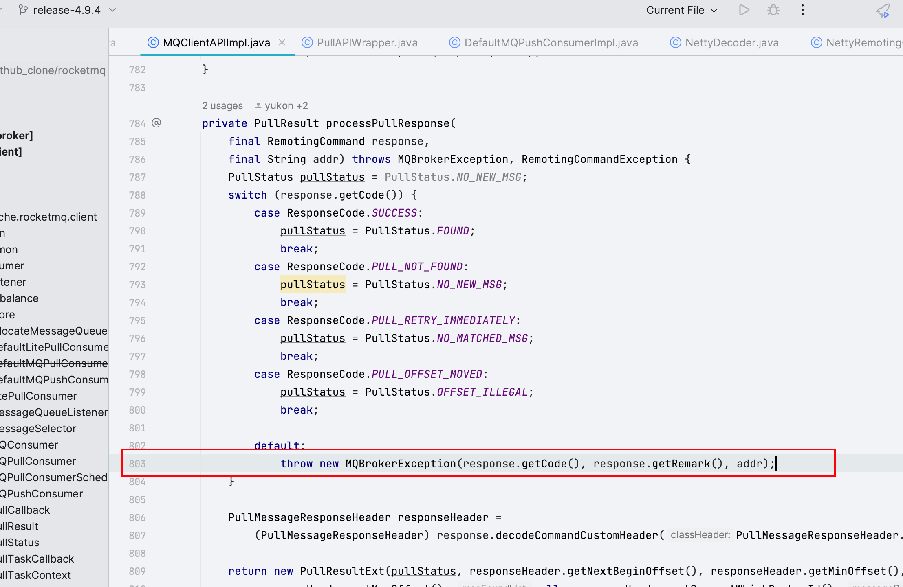
这看着应该是从broker端拉回来的数据有问题,不是正常能消费的数据,那就再往上层看看`RemotingCommand response`{.language-plaintext
.highlighter-rouge}这个对象是怎么来的吧\
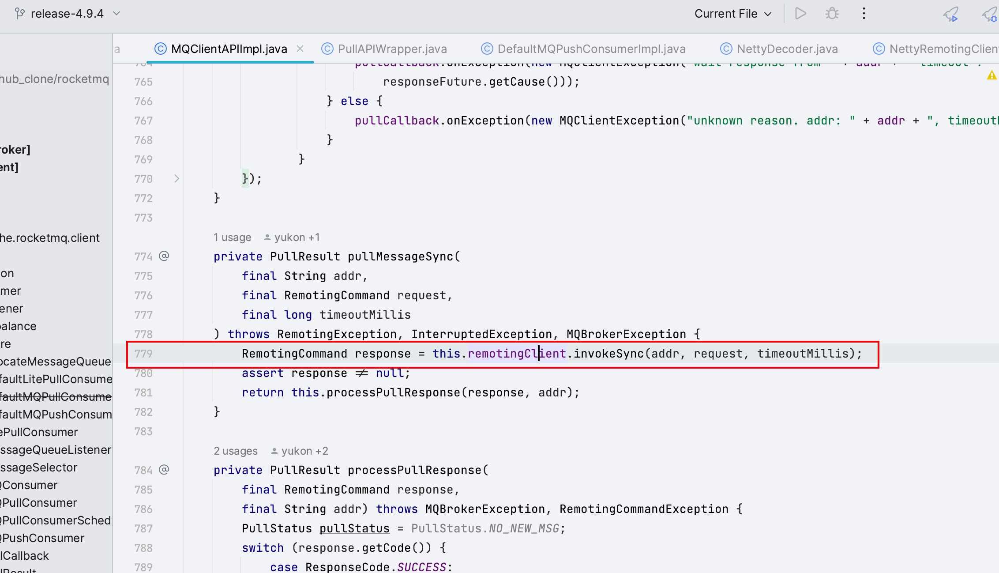
再往上一步点的话,会看到有两个地方一个是同步一个是异步,那看的话自然是看同步,毕竟同步代码更简单明了一些,最终的功能肯定是一样的,因为之前学了学netty以及知道RocketMQ是使用Netty通信的,所以看这个方法名字`this.remotingClient.invokeSync`{.language-plaintext
.highlighter-rouge}大概能猜出来它是和broker端进行通信然后获取到要消费的消息,那么接着点进去\
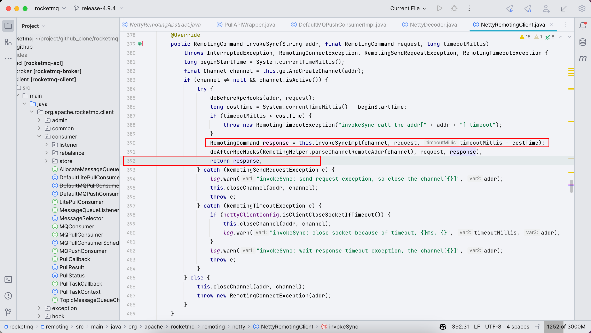
可以看到`response`{.language-plaintext
.highlighter-rouge}对象是从这个方法`invokeSyncImpl`{.language-plaintext
.highlighter-rouge}返回出来的,那就再进去看看\
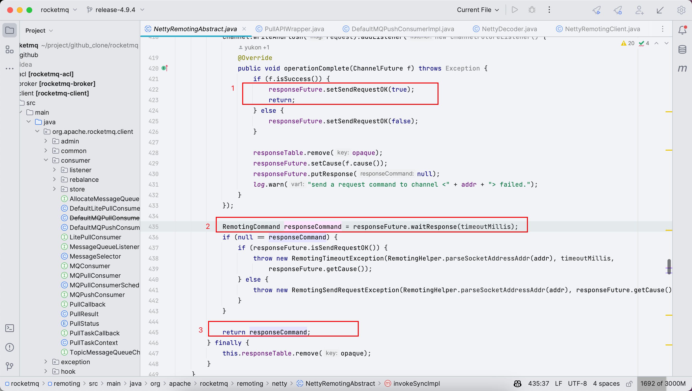
从这里看的话,并没有对这个对象做特殊的处理,这个时候一定有人有疑问,为什么他就是能正常返回呢,里边还有这么多的if,因为根据`CODE: 24 DESC: the consumer's group info not exist`{.language-plaintext
.highlighter-rouge}\
这个报错就能看出来,`response`对象一定是有的,并且顺利封装了,要不然不可能有这个报错打印,\
消费者client的源码算是看完了,并没有发现有什么问题,而这个报错是broker端返回给消费者client的,那就去搜搜broker的源码里哪里有这个报错吧

### 2.2 broker端源码追踪 

首先搜了一下这个报错的内容,`org.apache.rocketmq.broker.processor.PullMessageProcessor#processRequest(io.netty.channel.Channel, org.apache.rocketmq.remoting.protocol.RemotingCommand, boolean)`{.language-plaintext
.highlighter-rouge}在这个方法的 178行\
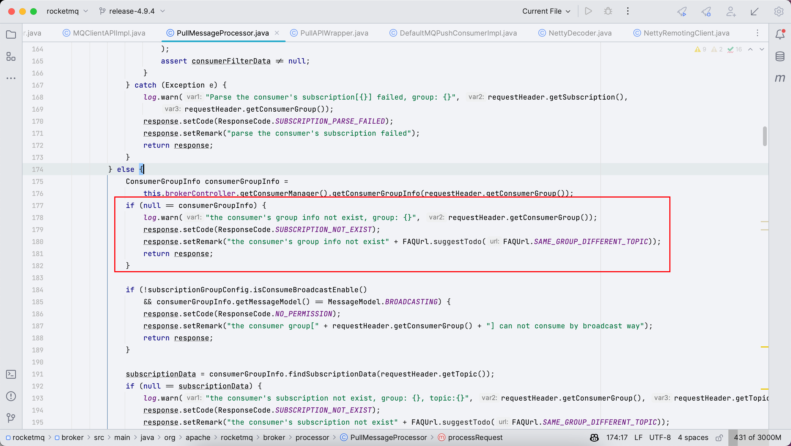
那这里就是`this.brokerController.getConsumerManager().getConsumerGroupInfo(requestHeader.getConsumerGroup());`{.language-plaintext
.highlighter-rouge}返回的结果为null,点进去看看\
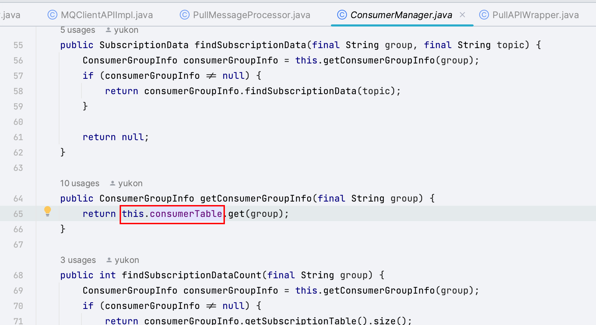
发现是这个`consumerTable`{.language-plaintext
.highlighter-rouge}取出来为null

``` {.hljs .language-swift}
private final ConcurrentMap<String/* Group */, ConsumerGroupInfo> consumerTable =  
    new ConcurrentHashMap<String, ConsumerGroupInfo>(1024);
```

这个对象是一个ConcurrentMap,那如果取出来为null的话,肯定是没有这个key,也就是没有这个消费者组的信息,我明明启动了消费者组怎么可能没有呢,那肯定是在哪个地方给remove掉了,接下来查一下调用remove的方法都在哪里

``` {.hljs .language-php}
org.apache.rocketmq.broker.client.ConsumerManager#doChannelCloseEvent
org.apache.rocketmq.broker.client.ConsumerManager#unregisterConsumer
```

就是这两个方法的逻辑里有remove方法\
查到这里我感觉需要看一下broker端的日志了\
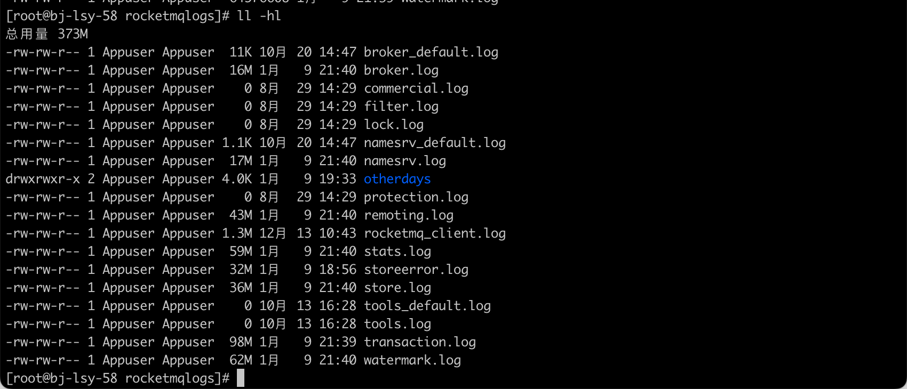
这么多日志,从何看起呢,先挑着日志多的看吧,毕竟卡卡刷屏,肯定日志量大,文件也不小\
这里的截图应该是已经归档过了的,现在broker.log才16M,记得出问题的时候100多M\
先看`broker.log`{.language-plaintext .highlighter-rouge}吧\
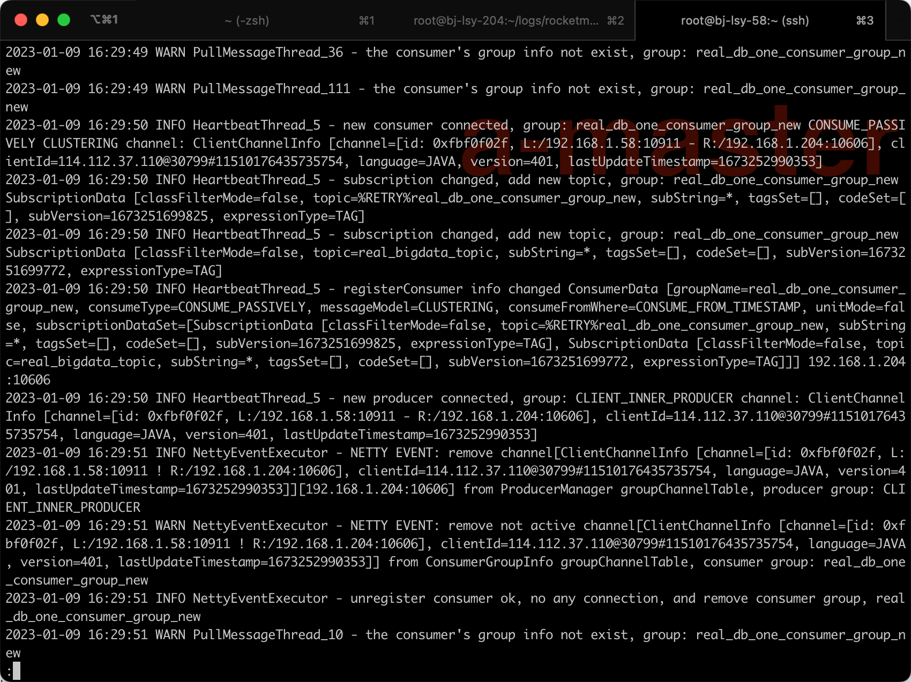
我从茫茫的打印日志中找到了这个\
看着大概就是说新创建了一个消费者组信息,然后直接就被删掉了\
只有`NETTY EVENT: remove not active channel`{.language-plaintext
.highlighter-rouge}这个是WARN,先查查这个在哪里报的吧\
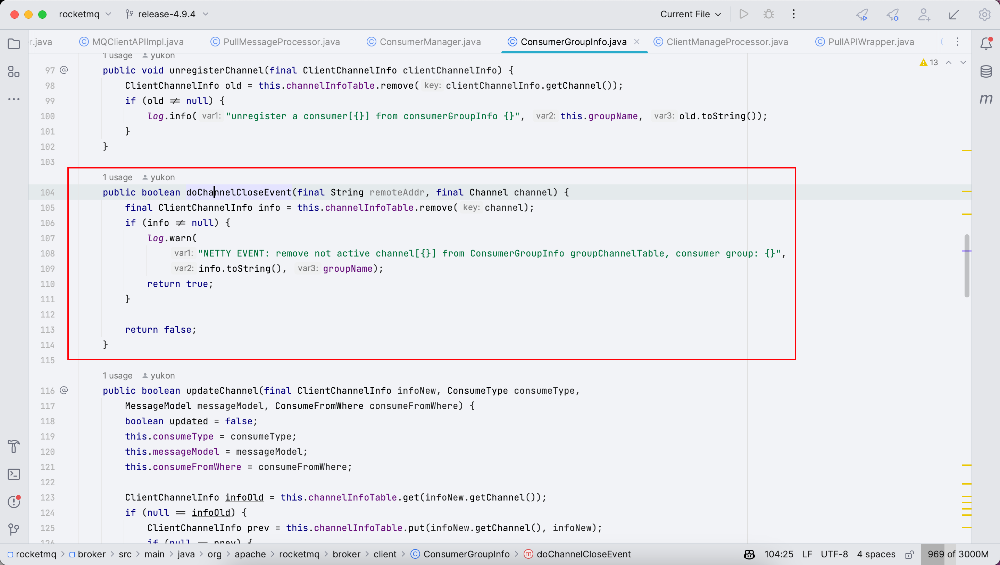
正好在`org.apache.rocketmq.broker.client.ConsumerManager#doChannelCloseEvent`{.language-plaintext
.highlighter-rouge}\
直接把`org.apache.rocketmq.broker.client.ConsumerManager#unregisterConsumer`{.language-plaintext
.highlighter-rouge}这个排除了\
那么这个方法的上一层就是\
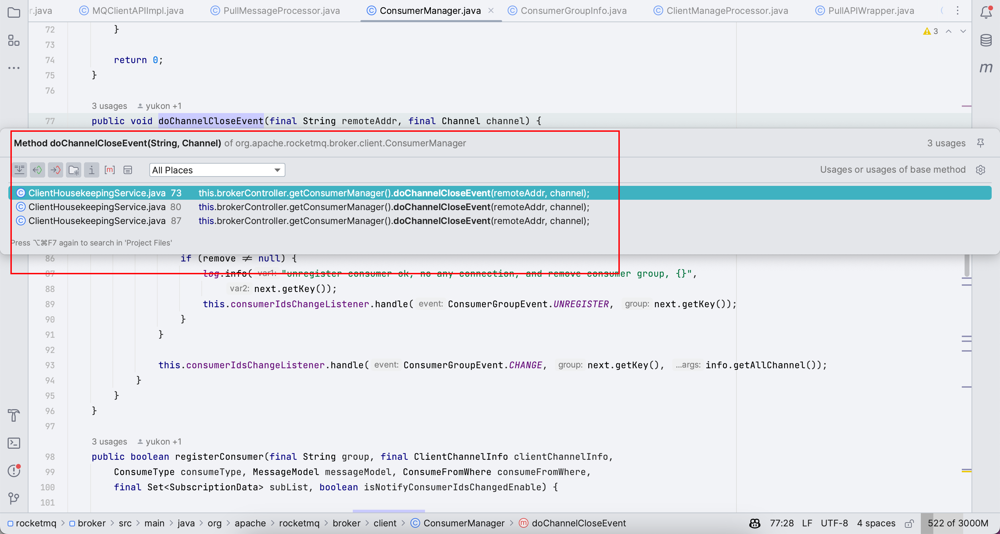
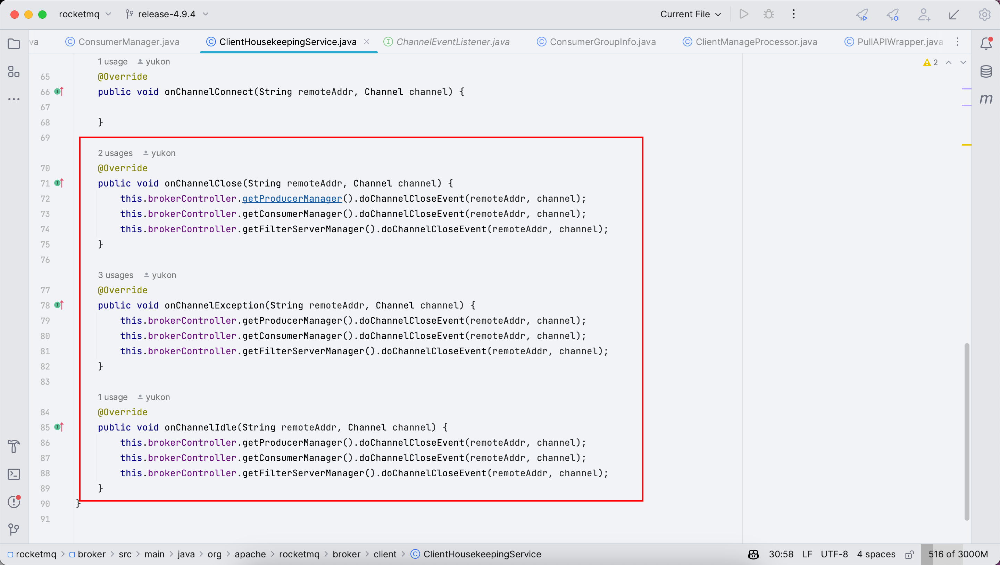
这些方法都是在一个run()方法里边跑的\
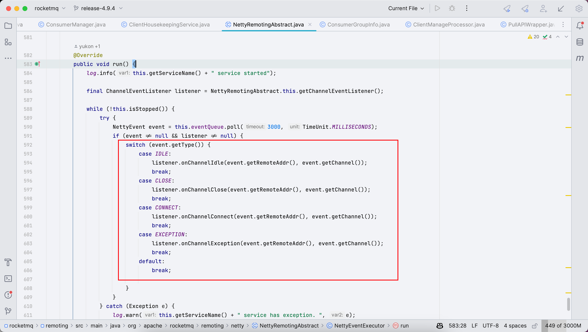
看的出来`this.eventQueue`{.language-plaintext
.highlighter-rouge}这个是存放NettyEvent的地方,而这三个方法都是从这里调用的\
那就看什么地方会把NettyEvent放到eventQueue中\
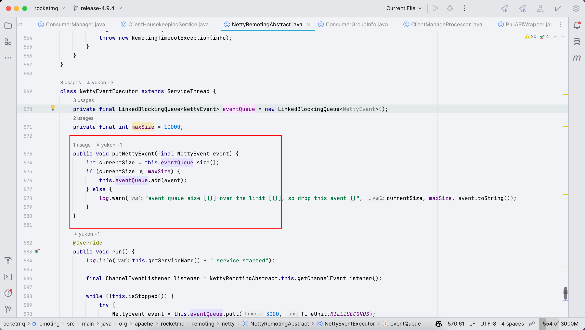
搜一下只有这个类中的`putNettyEvent`{.language-plaintext
.highlighter-rouge}方法才会add\
那再看看这个方法是从哪里调用的吧\
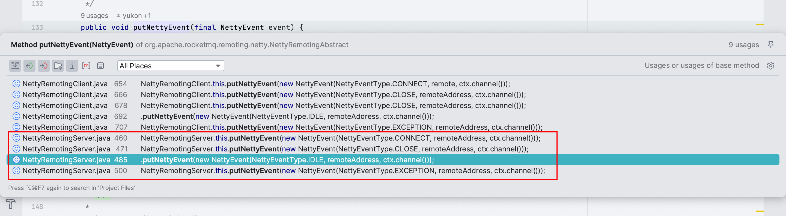
一共有这么多地方调用,想来咱们看的是broker的代码,那肯定是server吧,那就锁定在这四个了\
那也可以看到第一个type类型是`CONNECT`{.language-plaintext
.highlighter-rouge}直接排除,剩下的三个,\
分别都点进去看看,会发现这三个方法都伴随着日志打印\
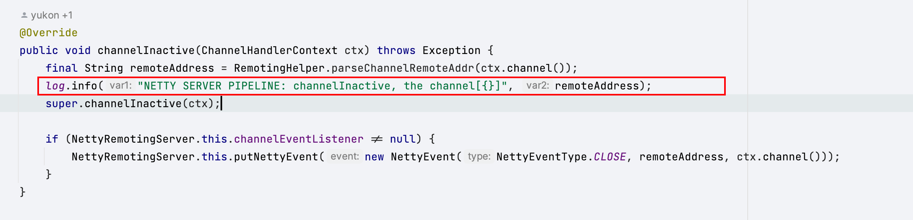
那咱们就去看看日志打印,然后定位出来具体是哪种事件导致了删除我的消费者组信息\
这里就有个问题,server端那么多日志文件应该看哪个哇?\
我想到了看下这个代码是在哪个包下\
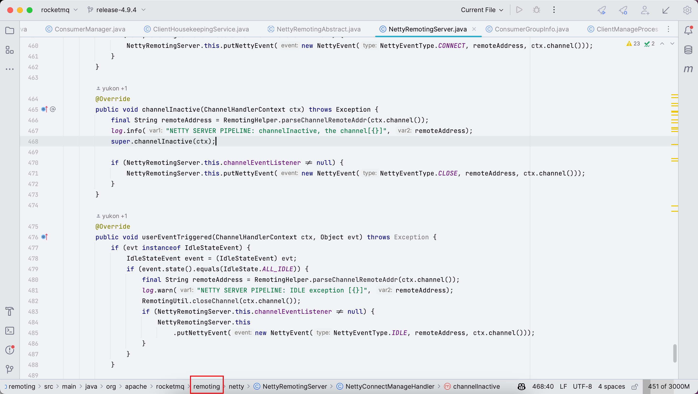
可以看到是remoting,那就看对应名字的log,此时打开消费者,观察日志\
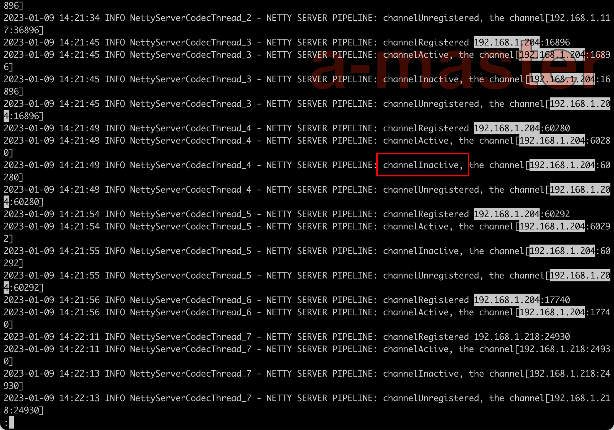
可以看到Active之后,直接Inactive,那肯定是这个事件导致的\
接下来搜这个日志打印,然后就会发现是触发了CLOSE事件\
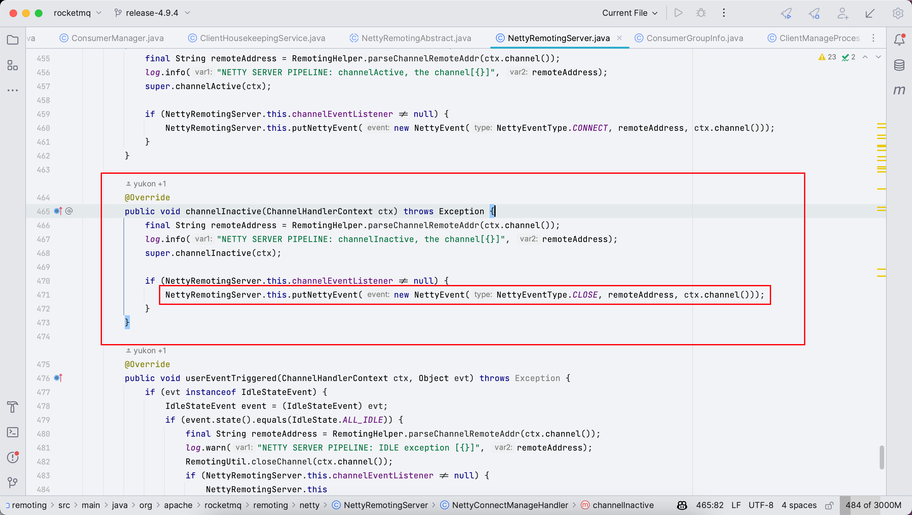
看到这里就有点懵了,首先是CLOSE事件,这就说明是正常关闭,是因为客户端不活跃导致的,那怎么想都是客户端有问题哇

## 3 继续查看客户端日志 

兜兜转转一圈,又回到了客户端日志,因为之前刷屏的都是`CODE: 24 DESC: the consumer's group info not exist`{.language-plaintext
.highlighter-rouge},但是这个是WARN类型的日志,我突发奇想,搜搜ERROR看看,果然找到了真正的问题\
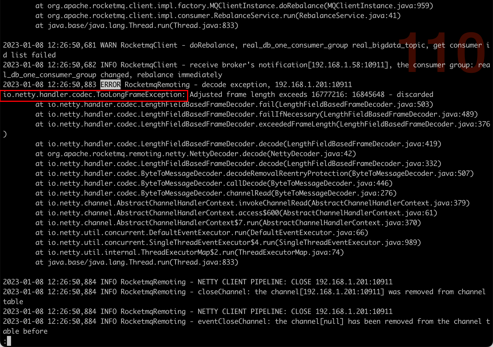
这个东西熟啊,这个是Netty的一个解码类,如果消息太长的话会报错,那这个想来应该是消息太长,但是我的消息肯定不会超过1M哇,通过堆栈可以看到是`org.apache.rocketmq.remoting.netty.NettyDecoder.decode`这里报错的,\
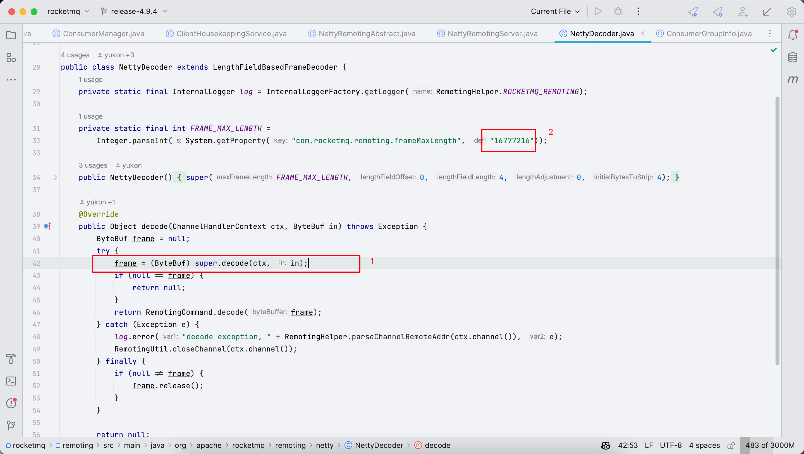
报错的是42行,那这个就是说当前消息太大了,解码出了问题,我猜想是把多个消息包装成一个大的消息,然后消费者client在进行解包处理,因为我的消息可能存才接近1M的,然后我一次获取100个消息,这样合并的话肯定会超过这个`16777216`
于是我在消费者启动上增加-Dcom.rocketmq.remoting.frameMaxLength=167772160,增加10倍看看,重新启动发现有效果,比之前好点了,起码不是刷屏报错了,但是还是不正常,偶尔还是有刷屏,Dashboard上也是一会有消费者一会没有,这样子还是不正常,那这样子的话只能把一次获取消息的个数减少了,于是我减少到了10,也就是这个参数`consumer.pullBatchSize = 10`
到这里这个报错总算是没有了,以我目前的技术水平,算是解决了问题,但是还是没有找到问题出在哪里\
`RemotingUtil.closeChannel(ctx.channel());`其中报错之后会调用这个关闭channel,估计是因为这个,具体之后再学习学习吧.

## 4 总结 

通过这次的源码跟踪查问题,体会到了RocketMQ的消息真的不能太大,不然会出现各种各样奇怪的问题,但是我们业务那边的消息如果按一个一个发送那真的是太多了,只能是业务那边合并成一个消息,然后再批量发到MQ,这就导致了单个消息可能接近1M,同时消费者的话一次拉取消息也不能太多...毕竟太多也处理不过来,索性减低一下速度,也是没有问题的,问题解决了,接下来就是把生产的东西往MQ中迁移了,希望不会再有问题...
