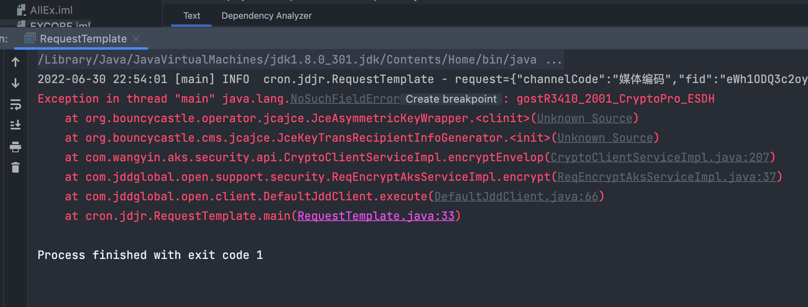

+++
title = 'java.lang.NoSuchFieldError 报错解决方法'
date = 2022-06-30T23:35:00+08:00
draft = false

+++
# java.lang.NoSuchFieldError 报错排查问题 

## 排查过程 

1.  报这个错的根本原因是**运行时**找不到对应的变量,那么为什么会找不到呢,因为运行的时候使用了错误的类
2.  为什么会使用错误的类呢,是因为使用了错误版本的jar包
3.  怎么会使用到错误的jar包呢 明明编译的时候好好的\
    我这个跟业务有点关系,对接别人的sdk,他们文档中写的是把5个jar包上传到自己的maven私服,然后项目中就可以使用了,最开始以为是他们自己的私有的jar,后来发现不是这样,有开源项目的jar,`bcprov-jdk15on`这个加解密的包\
    上传到私库的时候,使用了跟开源库不同的groupId,导致打出来的包里有两个不同版本的相同jar包,导致运行时使用了错误的jar包的类
4.  所以才会报这个错误

于是我把自己项目中的`bcprov-jdk15on`版本升级到了sdk给的版本,\
就可以正常运行了
