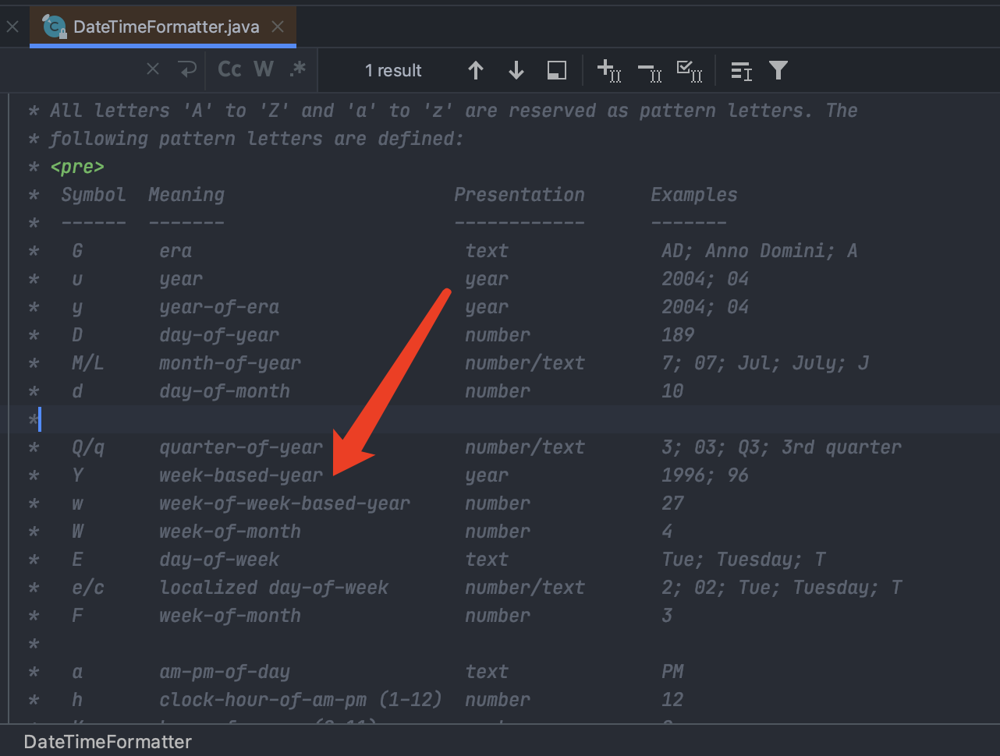

+++
title = 'java中 YYYY-MM-dd 格式化问题'
date = 2020-12-30T20:57:00+08:00
draft = false
+++
> 为什么说这个呢,因为今天新入职的开发问了我一个问题
> 就是今天出现的bug,日期格式化出现了明年的时间

当时并没有仔细看,由于之前用的还是
Date类(java8之后使用LocalDate类更好用),所以把LocalDate的一个代码复制给他了,试了试直接能用,也就没有管.\
然后第二天早晨看微信公众号的时候看有人发了一个 关于
`YYYY-MM-dd`的消息,然后点进去看了一下才知道应该使用
`yyyy-MM-dd` ,记录一下.

``` {.java .hljs}
        String format = LocalDate.of(2020, 12, 27).format(DateTimeFormatter.ofPattern("YYYY-MM-dd"));
        System.out.println("YYYY-MM-dd:"+format);

        format = LocalDate.of(2020, 12, 27).format(DateTimeFormatter.ofPattern("yyyy-MM-dd"));
        System.out.println("yyyy-MM-dd:"+format);

        //输出的是
        //YYYY-MM-dd:2021-12-27
        //yyyy-MM-dd:2020-12-27
```

首先可以看源码\
\
周所在的年\
查了一下有这个说法:\
当天所在的周属于的年份，一周从周日开始，周六结束，只要本周跨年，那么这周就算入下一年

总结: 用`yyyy-MM-dd` 就完事了
