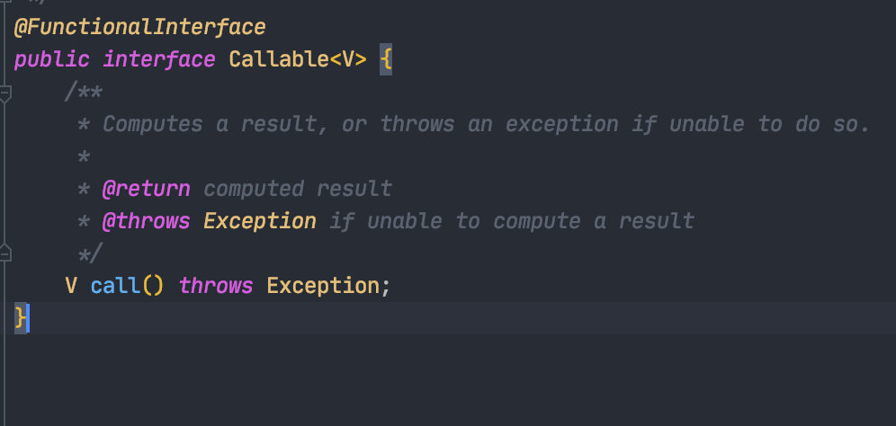
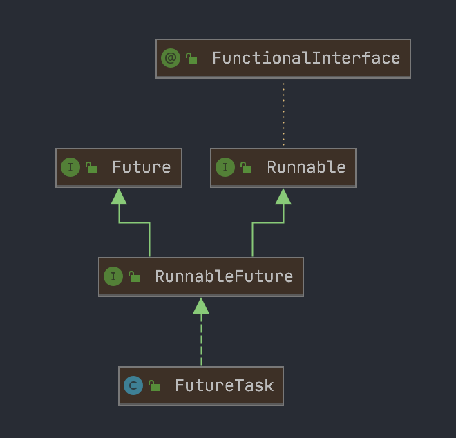
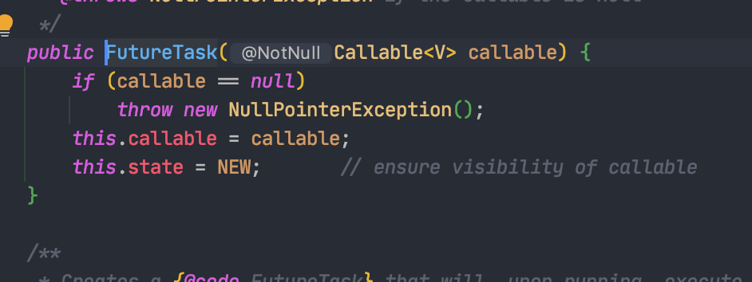
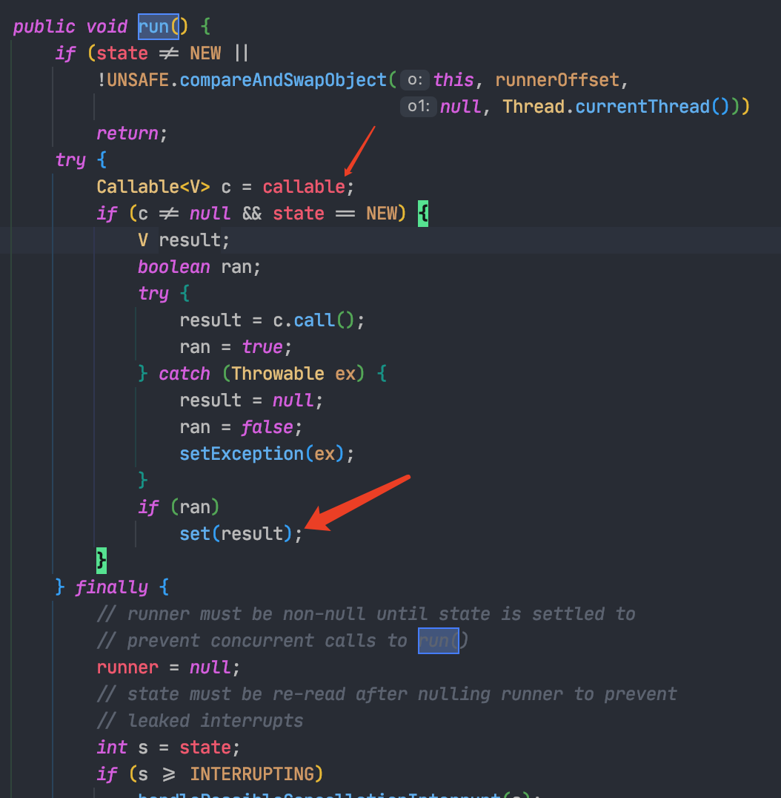
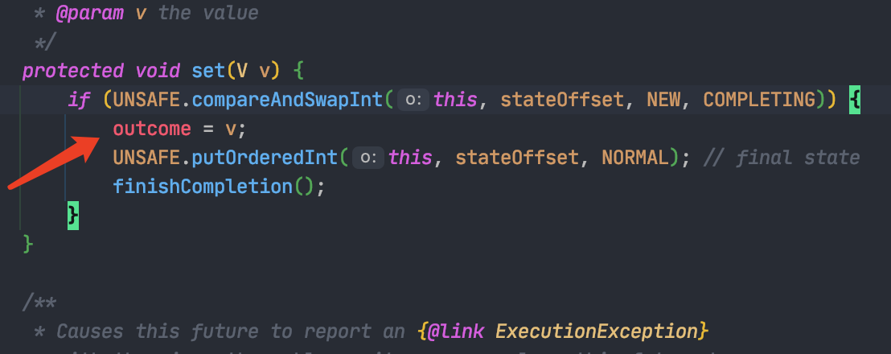
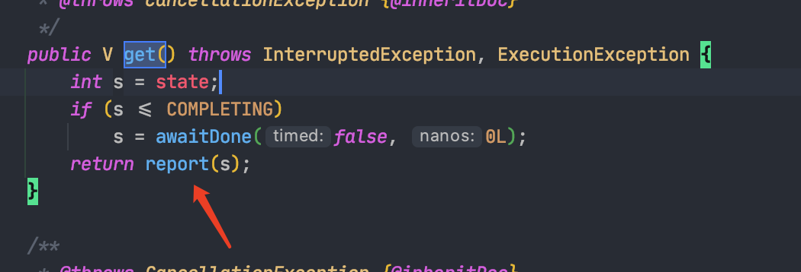
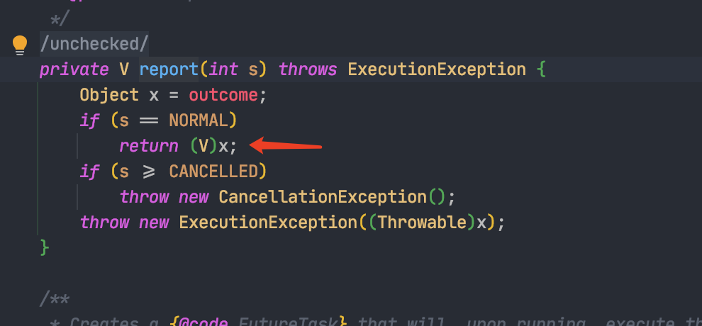

+++
title = 'java创建线程的几种方式'
date = 2020-11-19T22:33:07+08:00
draft = false
+++
# java创建线程的几种方式

## 一: 继承Thread

相当简单\...

重写run方法即可

``` {.java .hljs}
public class TRunnbale extends Thread{
    public static void main(String[] args) {
        TRunnbale tRunnbale = new TRunnbale();
        tRunnbale.start();
    }
    
    @Override
    public void run() {
        System.out.println("我要跑线程了");
    }
}
```

## 二:实现Runnable接口

这个是最简单的方式,直接实现Runnable接口 然后实现run()方法

最后放入 new Thread()中,然后 start()执行就行

``` {.java .hljs}
public class TRunnbale {
    public static void main(String[] args) {
        new Thread(new MyTask()).start();
    }
}

class MyTask implements Runnable{

    @Override
    public void run() {
        System.out.println("我要跑线程了!");
    }
}
```

## 三: 实现Callable接口

这个接口里需要实现的那个方法,是有一个返回值的,然后可以完成每个线程结束后,返回一个参数,线程外部可以接受这个参数



``` {.java .hljs}
public class TRunnbale extends Thread{
    public static void main(String[] args) {
        FutureTask<String> futureTask = new FutureTask(new MyTask());
        new Thread(futureTask, "线程A").start();
        try {
            String result = futureTask.get();
            System.out.println(result);
        } catch (InterruptedException e) {
            e.printStackTrace();
        } catch (ExecutionException e) {
            e.printStackTrace();
        }
    }

}

class MyTask implements Callable<String>{

    @Override
    public String call() throws Exception {
        // Do something...
        return "线程结束!";
    }
}
```

这里有一个FutureTask

咱们看一下这个类的源码,首先这个类实现了RunnableFuture这个接口

RunnableFuture这个接口 有继承了Runnable和Future

Runnable都知道是什么,这个接口是为了可以在 new Thread()中传入,

因为 Thread最终的start()方法就是执行run()方法中的代码



到现在可能会迷惑
Runnable不是没有返回值么,这个Future的返回值是怎么实现的呢,

咱们看下FutureTask的源码





Thread会调用run()方法,然后里边调用了`new FutureTask(new MyTask());`

里Callable的call()方法然后把这个值设置到当前对象的outcome参数上



然后主线程调用FutureTask的对象的get()方法,获得outcome这个值





当然get()方法会堵塞当前线程,一直到获取返回值后,再往后执行,

(之后会整理一下FutureTask的相关知识,这里就不具体说了)

## 四:使用java多线程来创建线程

> todo\...
